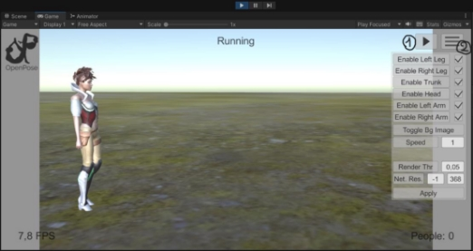
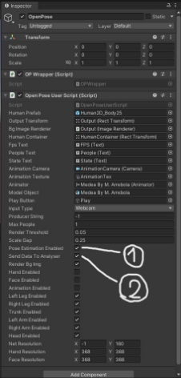
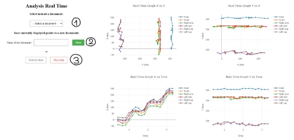
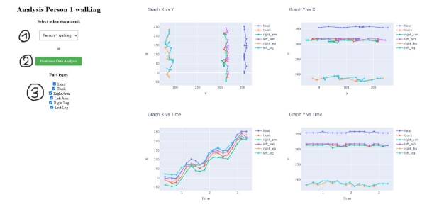

# Gait Analysis and Pose Estimation in Unity

_Brentan Simone 239959_

## Introduction

This document contains the instructions to understand how to run the project. The main folder consists of:

- README.pdf (this file)
- Report.pdf → the report giving details of the entire project
- Presentation folder → containing both the presentation slides and video
- Tutorial Videos folder → containing videos tutorial showing how to use the application
- Project folder → containing two other directories for the *Animator* application and the *Analyser* application (for details regarding the two application roles read the Report)

The structure of this explanation file will be mainly divided into two parts, the first part talking about everything related to *Unity* and *OpenPose*, the second part talking about the external web application made with *FastAPI* and the third party library *Plotly*.

## Animator (Unity and OpenPose)

The Unity version chosen for this project is *2021.3.23f1*

The animator folder consists of:

- Unity Application folder→ containing the entire package of the application
- Scene.unity → the shortcut link to easily open the unity scene
- Main Script.cs → the shortcut link to easily open the main script for the application execution, the one that manages the interaction with both OpenPose and the web application, as well as managing the correct display of the Unity Scene.

*Run the Scene with OpenPose:*

In order to run the application, open the unity scene and press play. By default, the scene will start with OpenPose disabled and with a default walking animation. The OpenPose detection can be enabled by pressing the right toggle inside the OpenPose game object (See below in *UNITY OPENPOSE COMPONENT*). After pressing the play button, in just a few seconds, the starting script will initiate the connection with the library and the image will start to be shown in the game canvas. Then, press the play button inside the game panel and the animation will start to move, interacting also with the OpenPose library for the pose estimation.

*Select a different animation:*

The Unity project already contains some walking animations which were already imported. To change it, follow the instructions:

1. Open the Unity Scene
2. Open the Unity 'Animator' panel (should be the third panel available beside 'Scene' and 'Game')
3. Click on the 'Animation' orange block
4. On the right panel, change the Animation by clicking on the small circle beside the animation name. After clicking it, a window will appear allowing to select a different animation
5. Press the Unity play button and the animation should be changed

*Import a new animation:*

Although there are already a small number of walking animations inside the project, you may want to add a new one. To do this, open the mixamo website and download the desired animation. Remember to chose these settings before downloading the animation:

- Format → FBX for Unity
- Skin → Without Skin

After downloading the animation, drag it into Unity, in the lower panel containing the project structure. After Unity has loaded it, enlarge the imported object and select the animation (blue triangle). Then we need to change two settings of the animation, open its settings and:

1. In the Animation panel, enable '*loop time*' to make the animation continuous
2. In the Rig panel, change '*Animation type*' from generic to humanoid

Then follow the steps described in the previous section to change the current animation and you are done.

### UNITY GAME SCENE

1. Start/Stop Animation button: through this button the animation can be started and stopped at will
1. Display Menu button: through this button the menu can be displayed or hidden
1. Buttons to enable/disable each body part detection
1. Input field to change the animation speed
1. Button to toggle background image (to show only the openpose skeleton)
1. Input fields to edit openpose CNN settings

**UNITY OPENPOSE COMPONENT **

1. Toggle OpenPose detection 
1. Toggle Sending of data to external application (when you have set up the Analyser, you can enable this setting and just start the animation, you will see data being collected and shown in the charts) 

## Analyser (FastAPI and Plotly)

The analyser folder consists of:

- FastAPI Application folder→ containing the entire package of the application
- run\_analyser.bat → the executable file that starts the Analyser application for Windows and opens up the browser window
- run\_analyser.sh → the executable file that starts the Analyser application for Linux and MacOS and opens up the browser window (not tested)

*Run the Analyser:*

The application can simply be run by running the correct '*run\_analyser*' executable file. If on Windows, run the batch file, otherwise run the bash file. The executable starts the FastAPI application and after 5 seconds opens up the browser window on the real-time analysis page. The delay is present so that the application has the time to start correctly.

When the Unity scene is started and the 'Send Data To Analyser' flag is enabled inside Unity correctly (see above in UNITY OPENPOSE COMPONENT), the data will be shown.

Alternatively, if a document has already been saved in a previous occasion, it can be opened and analysed without Unity running.

### ANALYSER REAL-TIME PAGE

1. Selector to open previously saved documents. After selecting a document, the page will change to the *Analyser Document Page*
1. Input text and button to save the data shown in the graphs as a document with a certain name
1. Buttons to refresh the data from the charts and to start/stop the streaming of data from the *Animator*

### ANALYSER DOCUMENT PAGE

1. Selector to switch to other saved documents
1. Button to move to the *Analyser Real-Time Page*
1. Toggles to enable/disable each body part. When a body part is disabled, it will not be shown in the graphs.

### PLOTLY GRAPHS

The graphs shown in the Analyser pages are made with the *Plotly* library. Every chart can be modified and operated on through some buttons made available by the library (you can see them in the top right corner of the previous image). It offers to zoom in/out and pan the graphs, in addition to performing other useful operations on the axis. When moving over a point, the graph will show the points values.
